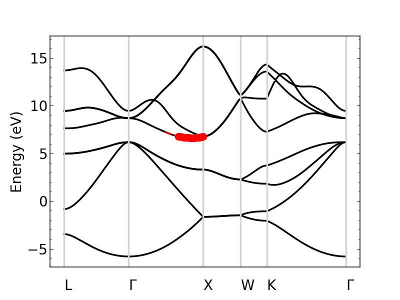
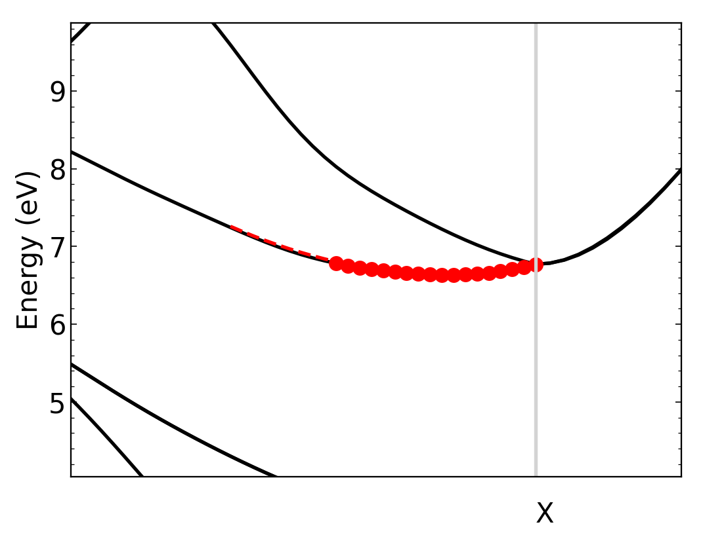
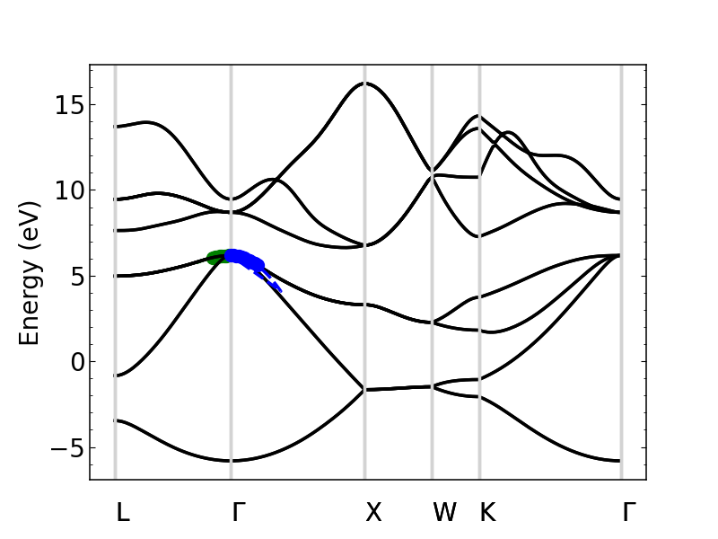
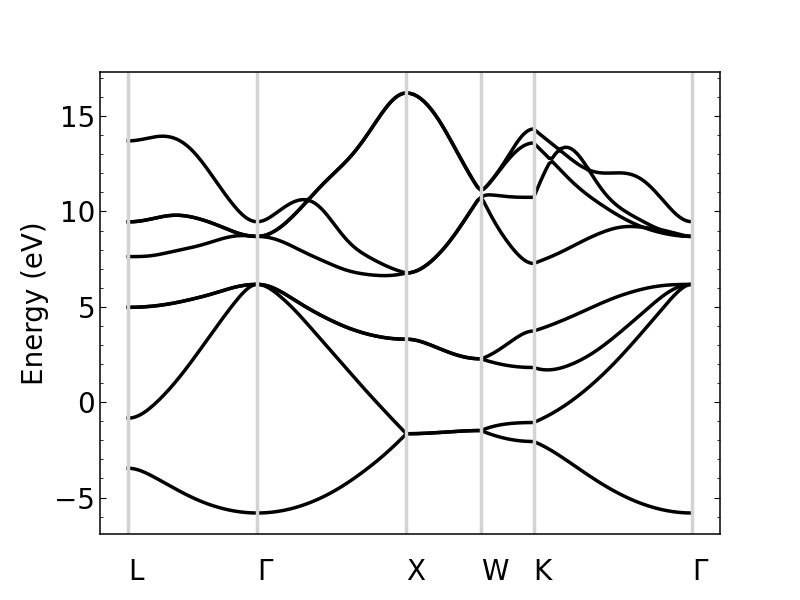
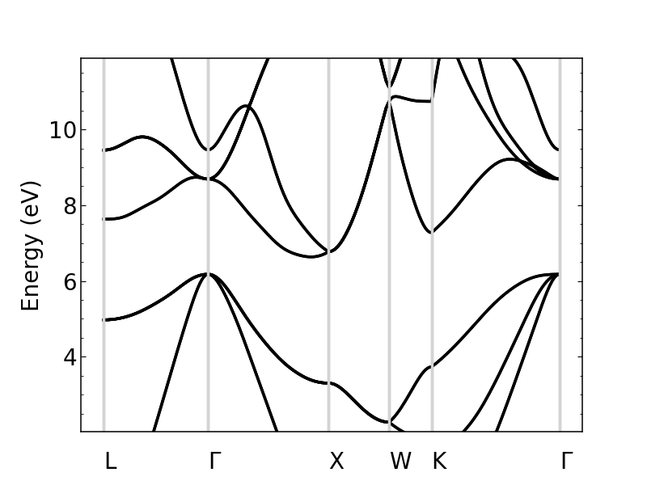
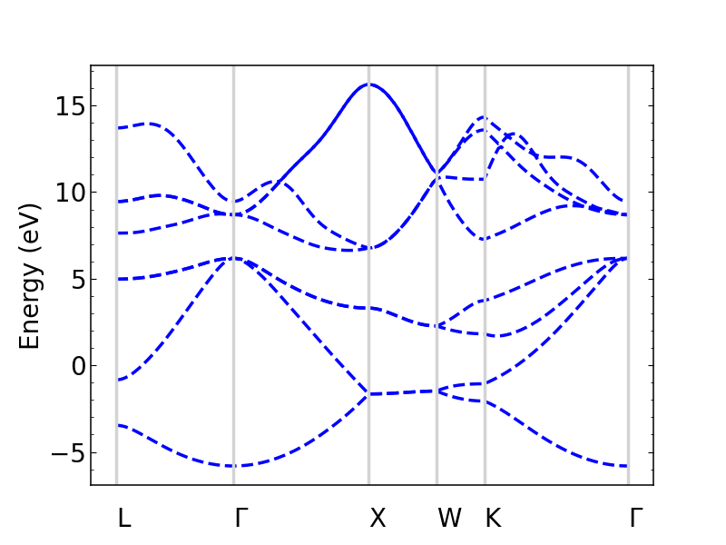
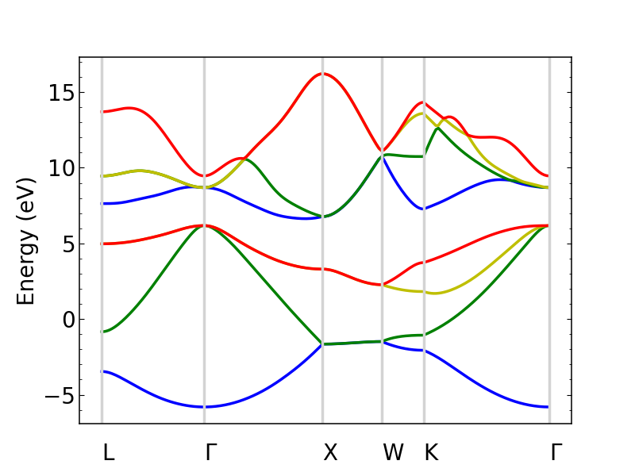

Bands tutorial
==============

In this section, we describe how to use Perturbopy to process a Perturbo ``bands`` calculation. 

The Perturbo ``bands`` calculation interpolates the band structure using Wannier functions. The first step is to run Perturbo with ``calc_mode`` = ``'bands'``. More details can be found on the `Perturbo website <https://perturbo-code.github.io/mydoc_interpolation#electronic-bandscalc_mode--bands>`_. 

The YAML file used in this tutorial can be generated by following the `Perturbo tutorial <https://perturbo-code.github.io/mydoc_interpolation>`_. The input files for this tutorial can be found `here <https://caltech.app.box.com/s/dxtieunoz2rgdns08os6vmtsxckmytrz/folder/101106240180>`_.

As described in the :ref:tutorials_intro we start by creating a :py:class:`.BandsCalcMode` object ``si_bands`` to store all the information from the YAML file.

.. code-block :: python

	import perturbopy.postproc as ppy

	si_bands = ppy.BandsCalcMode.from_yaml('si_bands.yml')

The rest of this section is organized as follows. :ref:`First <Accessing the data>`, we explain how the data can be accessed from ``si_bands``. :ref:`Then <Calculations>`, we explain how to perform calculations such as computing the direct bandgap, indirect bandgap, and effective mass. :ref:`Finally <Plotting the band structure>`, we explain how to plot the bands. 

Accessing the data
~~~~~~~~~~~~~~~~~~

Here, we describe how to access the data that is specific to the ``bands`` calculation, which are the k-points and the interpolated band energies. Please see the :doc:tutorials.rst page for more information on accessing data general to all calculation modes, such as input parameters and material properties.

The outputs of the calculation are stored in two the ``kpts`` attribute and ``bands`` attribute, described in more detail below.

K-points
--------

The k-points used for the bands calculation are stored in the :py:attr:`.BandsCalcMode.kpt` attribute, which is of type :py:class:`.RecipPtDB`. For example, to access the k-point coordinates and their units:

.. code-block :: python
	
	si_bands.kpt.points[:, 0]

	>> array([0.5, 0.5, 0.5])

	si_bands.kpt.units

	>> 'crystal'

Please see the section :ref:`handling_kpt_qpt` for details on accessing the k-points through this attribute.

Band energies
-------------

The interpolated band energies computed by the bands calculation are stored in the :py:attr:`.BandsCalcMode.bands` attribute, which is a :py:class:`.UnitsDict` object. The keys represent the band index, and the values are arrays containing the band energies corresponding to each k-point. 

.. code-block :: python

	si_bands.bands.keys()
	>> dict_keys([1, 2, 3, 4, 5, 6, 7, 8])

	si_bands.bands[8]
	>> array([13.69848506, 13.70154719, ..., 9.47676028, 9.46081004])

Please see the section :ref:`physical_quantities` for details on accessing the bands and their units.

Calculations
~~~~~~~~~~~~

Direct bandgap
--------------

The direct bandgap is the difference between the valence band maximum (VBM) and the condunction band minimum (CBM), for which the k-vectors are the same. For example, to compute the direct bandgap in silicon between the valence band (band index 4) and conduction band (band index 5), we call :py:meth:`.BandsCalcMode.direct_bandgap` with the two band indices as inputs:

.. code-block :: python
	
	# Compute the direct bandgap between bands 4 and 5
	si_bands.direct_bandgap(4,5)

	>> (2.513629987199999, array([0., 0., 0.]))

:py:meth:`.BandsCalcMode.direct_bandgap` returns the bandgap, 2.51 eV, and the k-point at which that direct bandgap occurs, [0, 0, 0]. Note that silicon is an indirect bandgap material, so this is not the minimal energy difference between the valence band and conduction band.

Indirect bandgap
----------------

The indirect bandgap is the difference between VBM and CBM, without the same k-vector constraint. For example, to compute the indirect bandgap in silicon between the valence band and conduction band, we call :py:meth:`.BandsCalcMode.indirect_bandgap` method with the two band indices as inputs:

.. code-block :: python

	# Compute the indirect bandgap between bands 4 and 5
	si_bands.indirect_bandgap(4,5)

	>> (0.4577520852000001, array([0., 0., 0.]), array([0.43137, 0.     , 0.43137]))

:py:meth:`.BandsCalcMode.indirect_bandgap` returns the bandgap, 0.458 eV, the k-point of VBM is [0, 0, 0], and the k-point of CBM is [0.43137, 0., 0.43137].

Effective mass
--------------

The effective mass is computed in the parabolic approximation from the curvature of the parabola. 

.. math::

   m^* = \frac{1}{{\frac{1}{{\hbar^2}} \frac{d^2E}{dk^2}}}

We can compute the effective mass of a carrier at band index ``n`` and k-point ``kpoint`` in the direction of the ``direction`` input. If no direction is provided, the longitudinal effective mass will be computed (i.e. the direction will be the same as the kpoint). Note that a direction must be provided if the k-point is [0, 0, 0]. 

Another important input is ``max_distance``, which is the maximum distance from the central k-point to other k-points included in the calculation. For example, let's compute the longitudinal effective mass at [0.43, 0., 0.43], which is the CBM of silicon. We will use ``max_distance`` of 0.12. The experimental value is ~0.98 :math:m_e

.. code-block :: python

	# Compute the effective mass of an electron at band 5, k-point [0.43, 0, 0.43]
	# by a parabolic approximation that includes longitudinal k-points at a max
	# distance of 0.12 from [0.43, 0, 0.43]
	si_bands.effective_mass(5, [0.43, 0, 0.43], max_distance=0.12) 
	
	>> 0.9714141122114681

If an axis is provided, the band structure will be plotted, as well as the points chosen for the effective mass calculation and a dashed line reflecting the parabolic approximation (with a color specified by input ``c``). Let's plot the previous result.

.. code-block :: python

	import matplotlib.pyplot as plt

	fig, ax = plt.subplots()

	plt.rcParams.update(ppy.plot_tools.plotparams)

	si_bands.effective_mass(5, [0.43, 0, 0.43], max_distance=0.12, ax=ax) 
	
	>> 0.9714141122114681

The plot shows the bands, with the points selected for the approximation plotted in red. Note that the points and line of fit stop at the "X" point because past here, the effective mass is no longer longitudinal.

We can zoom in to see the parabolic fit better. The dashed line is the parabolic fit, and extends past the points.

To increase the number of points used in the calculation, we should increase max_dist.

Next, let's compute the effective mass for holes at the VBM (n=4, kpoint=[0, 0, 0]) in the [0.5, 0.5, 0.5] direction and [0.5, 0, 0.5] directions, which are the left and right effective masses, respectively. Note that, because this is a hole, we expect the effective mass to be negative. 

.. code-block :: python

	m_left = si_bands.effective_mass(4, [0, 0, 0], max_distance=0.1, direction=[0.5, 0.5, 0.5], ax=ax, c="r")
	m_right = si_bands.effective_mass(4, [0, 0, 0], max_distance=0.1, direction=[0.5, 0, 0.5], ax=ax, c="b")
	
	m_left
	m_right

	plt.show()

	>> -0.7826178453262155
	>> -0.3391250154182139

.. _plot_bands:

Plotting the band structure
~~~~~~~~~~~~~~~~~~~~~~~~~~~

Perturbopy allows users to quickly plot the band structure with a few lines of code: 

.. code-block :: python

	import perturbopy.postproc as ppy
	import matplotlib.pyplot as plt

	fig, ax  = plt.subplots()

	si_bands = ppy.BandsCalcMode.from_yaml('si_bands.yml')

	si_bands.plot_bands(ax)

For a nicer plot, we can use the ``plotparams`` dictionary provided in the ``plot_tools`` module. We can also add k-point labels (link to the k-point section) so that these are automatically added to the plot. 

.. code-block :: python

	import perturbopy.postproc as ppy
	import matplotlib.pyplot as plt

	fig, ax  = plt.subplots()
	plt.rcParams.update(ppy.plot_tools.plotparams)

	si_bands = ppy.BandsCalcMode.from_yaml('si_bands.yml')
	si_bands.kpt.add_labels(ppy.plot_tools.points_fcc)

	si_bands.plot_bands(ax)

Note that k-point labels can be removed from the plot by setting the ``show_labels`` input to False.

We can also change the energy window: 

.. code-block :: python

	si_bands.plot_bands(ax, energy_window=[2,12])

Other options include changing the linestyle and color.

.. code-block :: python

	si_bands.plot_bands(ax, c='b', ls='--')

	
The colors and linestyles can also be a list.

.. code-block :: python

	si_bands.plot_bands(ax, c=['r','b','g','y'])

