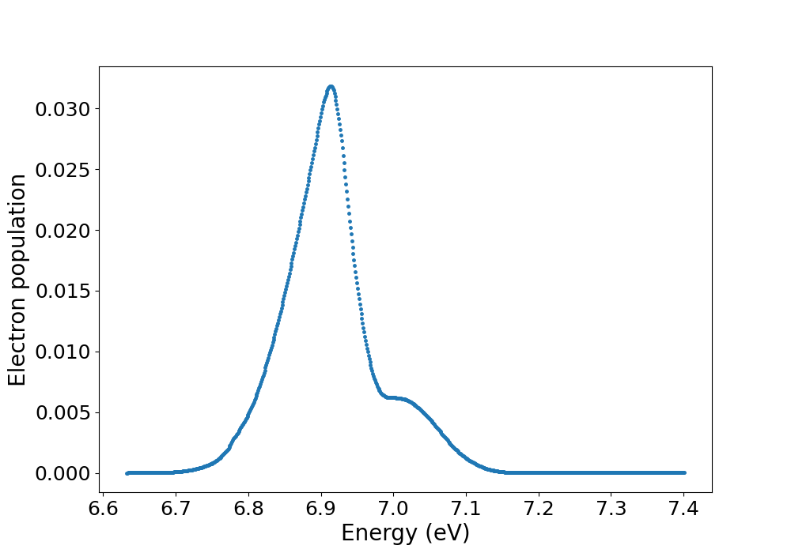

Dynamics-pp tutorial
=====================

In this section, we describe how to use Perturbopy to process a Perturbo ``dynamics-pp`` calculation.

The ``dynamics-pp`` calculation postprocesses the ultrafast dynamics calculations and computes the carrier population as a function of energy and time. Please see the `Perturbo website <https://perturbo-code.github.io/mydoc_dynamics.html#dynamics-post-processingcalc_mode--dynamics-pp>`_ for more details. We first run the Perturbo calculation following the instructions on the Perturbo website and obtain the YAML file, *'si_dynamics-pp.yml'*. We also obtain the popu HDF5 file *'si_popu.h5'*, which stores results from the ``dynamics-pp`` calculation too lage to be outputted to the YAML file.

Next, we create the :py:class:`.DynaPP` object using the YAML file and popu HDF5 file as an input. This :py:class:`.DynaPP` object contains all of the information from those two files.

.. code-block :: python

    import perturbopy.postproc as ppy

    popu_path = "si_popu.h5"
    yaml_path = "si_dynamics_pp.yml"

    si_dyna_pp = ppy.DynaPP.from_hdf5_yaml(popu_path, yaml_path)

Accessing the data
-------------------

The times are stored in the attribute :py:attr:`DynaPP.times` with units :py:attr:`DynaPP.time_units`.

.. code-block :: python
    
    si_dyna_pp.times

    >> array([ 0.,  2.,  4.,  6.,  8., 10., 12., 14., 16., 18., 20., 22., 24.,
               26., 28., 30., 32., 34., 36., 38., 40., 42., 44., 46., 48., 50.])

    si_dyna_pp.time_units
    >> 'fs'

The energies are stored in the attribute :py:attr:`DynaPP.energy_grid` with units :py:attr:`DynaPP.energy_units`.

.. code-block :: python

    # There are 769 energies in the grid, corresponding to (emax - emin) / boltz_de
    si_dyna_pp.energy_grid.shape
    >> (769,)

    # The first 4 energies in the grid
    si_dyna_pp.energy_grid[:4]
    >> array([6.63261242, 6.63361242, 6.63461242, 6.63561242])

    # The units are eV
    si_dyna_pp.energy_units
    >> 'eV'

Finally, the populations are stored in the :py:attr:`DynaPP.popu` attribute.

.. code-block :: python
    
    # There are 769 energies in the grid and 26 time points
    si_dyna_pp.popu.shape
    >> (769, 26)

    # The populations corresponding to the first 4 energies in the grid at the 25th time point
    si_dyna_pp.popu[:4, 25]
    >> array([0.00000000e+00, 0.00000000e+00, 9.45434167e-09, 4.15859811e-08])

Plotting the data
------------------

We can plot the carrier population function as a function of energy at a particular time point. Below, we plot it for the 25th time point.

.. code-block :: python
    
    import matplotlib.pyplot as plt

    fig, ax = plt.subplots()

    snap_number=25

    plt.plot(si_dyna_pp.energy_grid,si_dyna_pp.popu[:, snap_number],marker='o',linestyle='', markersize=2.5)

    plt.xlabel('Energy (eV)', fontsize = 20)
    plt.ylabel('Electron population', fontsize = 20)
    plt.xticks(fontsize= 18)
    plt.yticks(fontsize= 18)

    plt.show()

