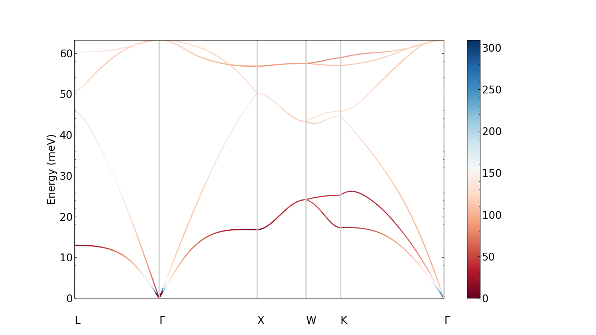
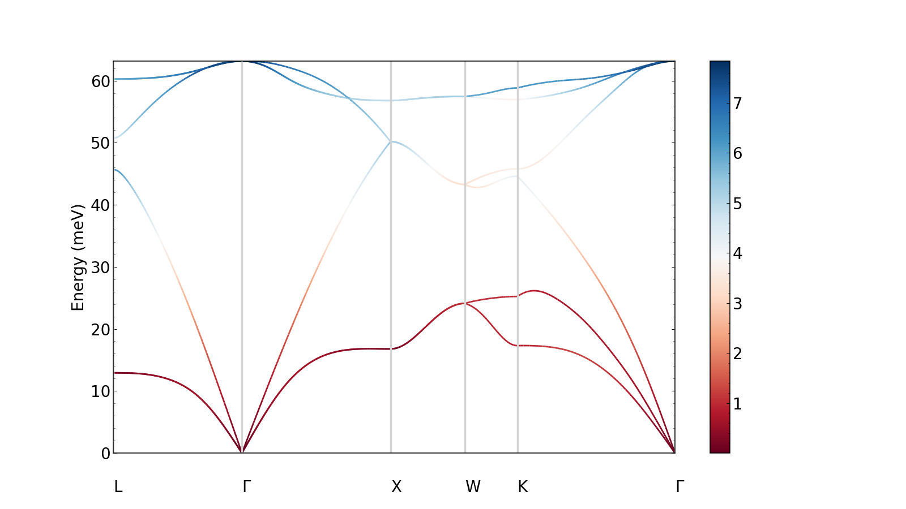
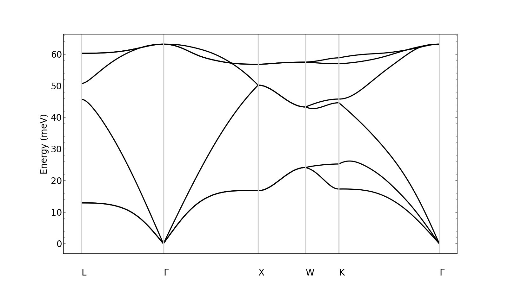
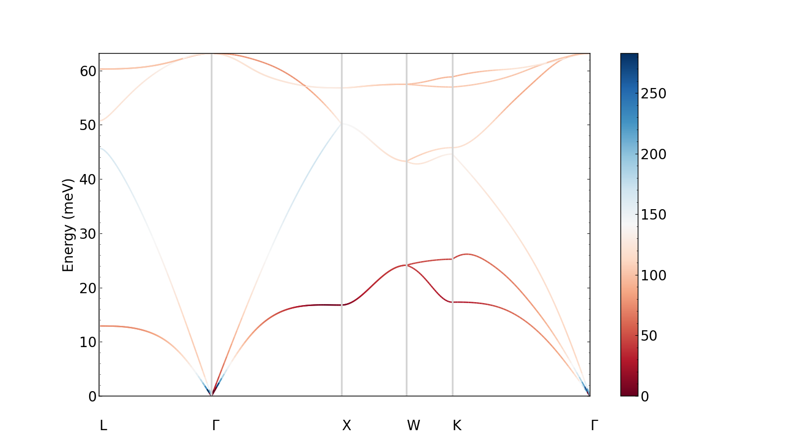

Ephmat tutorial
===============

In this section, we describe how to use Perturbopy to process a Perturbo ``ephmat`` calculation. 

The ephmat calculation computes the e-ph elements between electrons in states defined by a k-point and band index, and phonons in states defined by a q-point and mode index. We first run the Perturbo calculation following the instructions on the Perturbo website and obtain the YAML file, *si_phdisp.yml*. For more information, please refer to the `Perturbo website <https://perturbo-code.github.io/mydoc_interpolation.html#e-ph-matrix-elements-calc_mode--ephmat>`_. 

Next, we create the :py:class:`.Ephmat` object using the YAML file as an input. This object contains all of the information from the YAML file.

.. code-block :: python

	import perturbopy.postproc as ppy

	si_ephmat = ppy.EphmatCalcMode.from_yaml('si_ephmat.yml')

Accessing the data
~~~~~~~~~~~~~~~~~~

The k-points are stored in :py:attr:`Ephmat.kpt`, which is a :py:class:`RecipPtDB` object. The data for the phonons is stored analogously in :py:attr:`Ephmat.qpt` (another :py:class:`RecipPtDB` object) and :py:attr:`Ephmat.phdisp`, a :py:class:`UnitsDict` object where the keys are the phonon mode and the values are the phonon energies computed across the q-points.

.. code-block :: python
	
	# Access the k-point coordinates. There is only one in this calculation. The units are in crystal coordinates.
	si_ephmat.kpt.points
	>> array([[0.],
       [0.],
       [0.]])
	si_ephmat.kpt.units
	>> 'crystal'

	# There are 206 q-point coordinates (we display the first two below). The units are in crystal coordinates.
	si_ephmat.qpt.points.shape
	>> (3, 206)

	si_ephmat.qpt.points[:, :2]
	>> array([[0.5   , 0.4902],
       [0.5   , 0.4902],
       [0.5   , 0.4902]])

	si_ephmat.qpt.units
	>> 'crystal'

	# Access the phonon energies, which are a UnitsDict. There are 6 modes, which are the keys of the dictionary.
	si_ephmat.phdisp.keys()
	>> dict_keys([1, 2, 3, 4, 5, 6])

	# Phonon energies of the first 2 q-points in phonon mode 3
	si_ephmat.phdisp[3][:2]
	>> array([45.69220981, 45.61860655])

	si_ephmat.phdisp.units
	>> 'meV'

The ephmat calculation interpolates the deformation potentials and e-ph elements which are stored in dictionaries :py:attr:`Ephmat.defpot` and :py:attr:`Ephmat.ephmat`, respectively. Both are :py:class:`UnitsDict` objects. The keys represent the phonon mode, and the values are (num_kpoints x num_qpoints) size arrays.

.. code-block :: python

	# There are 6 keys, one for each mode
	si_ephmat.ephmat.keys()
	>> dict_keys([1, 2, 3, 4, 5, 6])

	# There is 1 k-point and 206 q-points, so the e-ph matrix is 1 x 206.
	si_ephmat.ephmat[1].shape
	>> (1, 206)

	# The e-ph matrix elements corresponding to the first phonon mode, first (and only) k-point, and first two q-points
	si_ephmat.ephmat[1][0, :2]
	>> array([[11.80265941, 11.92405409]])

	# units are in meV
	si_ephmat.ephmat.units
	>> 'meV'

	# We can extract analogous information from the deformation potential
	si_ephmat.defpot[1].shape
	>> (1, 206)

	si_ephmat.defpot.units
	>> 'eV/A'

Plotting the data
-----------------

We can quickly visualize the e-ph elements by plotting them as a colormap overlaid on the phonon dispersion. Below, we plot the e-ph elements computed at the k-point [0, 0, 0] along the q-point path.

.. code-block :: python
	
	plt.rcParams.update(ppy.plot_tools.plotparams)
	si_ephmat.qpt.add_labels(ppy.plot_tools.points_fcc)

	fig, ax  = plt.subplots()
	si_ephmat.plot_ephmat(ax)
	plt.show()

We can also plot the deformation potential instead.

.. code-block :: python

	si_ephmat.plot_defpot(ax)
	plt.show()

Finally, if we want to plot simply the phonon dispersion,

.. code-block :: python

	si_ephmat.plot_phdisp(ax)
	plt.show()

If we performed the ``ephmat`` calculation with multiple k-point as well as q-points, we can choose the k-point that we plot the e-ph elements or deformation potentials for across all the q-points.

For example, let's say we repeated the calculation, but with three different k-points. The q-points remain the same.

.. code-block :: python

	si_ephmat_expanded = ppy.EphmatCalcMode.from_yaml('si_ephmat_expanded.yml')

	si_ephmat_expanded.kpt.points

	>> [[0.  0.  0. ]
		[0.5 0.5 0.5] 
		[0.5 0.  0.5]]

Now when we plot the e-ph elements, we can choose whether we want to plot them for the first, second, or third k-point by setting ``kpoint_idx``. For example, let's plot results for the third k-point, [0.5, 0.0, 0.5]. (By default, the first k-point is used.)

.. code-block :: python
	
	plt.rcParams.update(ppy.plot_tools.plotparams)
	si_ephmat_expanded.qpt.add_labels(ppy.plot_tools.points_fcc)

	fig, ax  = plt.subplots()
	si_ephmat_expanded.plot_ephmat(ax, kpoint_idx=2)
	plt.show()

