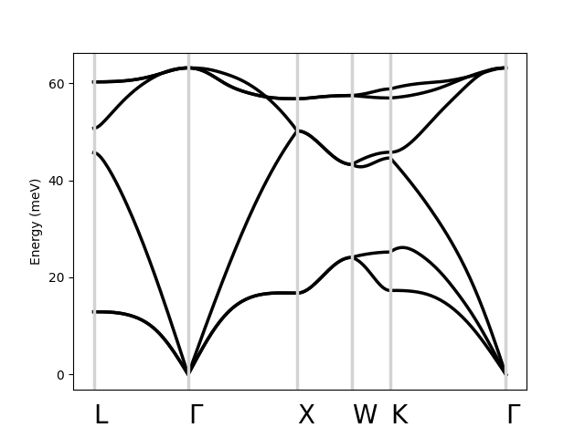

Phdisp tutorial
===============

In this section, we describe how to use Perturbopy to process a Perturbo ``phdisp`` calculation. 

The ``phdisp`` calculation mode interpolates the phonon dispersion by Fourier transforming real-space interatomic force constants. We first run the Perturbo calculation following the instructions on the Perturbo website and obtain the YAML file, *si_phdisp.yml*. For more information, please refer to the `Perturbo website <https://perturbo-code.github.io/mydoc_interpolation#phonon-dispersioncalc_mode--phdisp>`_. 

Next, we create the :py:class:`.Phdisp` object using the YAML file as an input. This object contains all of the information from the YAML file.

.. code-block :: python

    import perturbopy.postproc as ppy

    si_phdisp = ppy.Phdisp.from_yaml('si_phdisp.yml')

Accessing the data
~~~~~~~~~~~~~~~~~~

The main results of the results are stored in two objects: 

* :py:attr:`.Phdisp.qpt` stores the q-points used in the calculation
* :py:attr:`.Phdisp.phdisp` stores the interpolated phonon energies computed

See :ref:`exporting_data` to learn how to access data from ``si_phdisp`` that is general for all calculation modes, such as input parameters and the material's crystal structure. # ERROR

Q-points
--------

:py:attr:`.Phdisp.qpt` is a :py:class:`.RecipPtDB` object that stores the q-points. For example, we can access the first q-points with the :py:attr:`.RecipPtDB.points` property, which has the shape 3xN (where N is the number of q-points). Note that the q-points are column-oriented. For example, to access the first two q-points:

.. code-block :: python

    # Access the first two q-points
    si_phdisp.qpt.points[:, :2]

    >> array([[0.5   , 0.4902],
          [0.5   , 0.4902],
          [0.5   , 0.4902]]) 

    # The points are a 3x206 array, as there are 206 q-points
    si_phdisp.qpt.points.shape
    >> (3, 206)

We can also access the units of the q-points:

.. code-block :: python

    si_phdisp.qpt.units
    >> 'crystal'

Please see the section :ref:`handling_kpt_qpt` for more details on accessing information from :py:attr:`.Phdisp.qpt`, such as labeling the q-points and converting to Cartesian coordinates.

Phonon energies
---------------

The interpolated phonon dispersion computed by the phdisp calculation are stored in the :py:attr:`.Phdisp.phdisp` attribute, which is a :py:class:`.UnitsDict` object. The keys represent the phonon mode, and the values are arrays containing the phonon energies corresponding to each q-point. 

.. code-block :: python

    # The keys correspond to phonon modes
    si_phdisp.phdisp.keys()
    >> dict_keys([1, 2, 3, 4, 5, 6])

    # The values are arrays of phonon energies, of length N (the number of q-points)
    si_phdisp.phdisp[6].shape
    >> (206,)

    # Phonon energies of the 6th mode
    si_phdisp.phdisp[6]
    >> array([60.26613499, 60.2667598 , 60.26863911, ..., 63.1558948])

Please see the section in the tutorial :ref:`physical_quantities` for more details on the :py:class:`.UnitsDict` object. 

Plotting the phonon dispersion
------------------------------

We can quickly visualize the data by plotting the phonon dispersion.

.. code-block :: python

    import perturbopy.postproc as ppy
    import matplotlib.pyplot as plt

    # Create a figure and axis for plotting
    fig, ax  = plt.subplots()

    # Optional, used to format the plot
    plt.rcParams.update(ppy.plot_tools.plotparams)

    # Optional, used to label the q-points with labels for the FCC crystal structure.
    # For example, [0.5, 0.5, 0.5] is the 'L' point in the FCC Brillouin zone.
    si_phdisp.qpt.add_labels(ppy.plot_tools.points_fcc)

    si_phdisp.plot_phdisp(ax)
    plt.show()

For more information on how to customize this plot, please refer to the analogous section in the Bands tutorial, :ref:`plot_bands`.