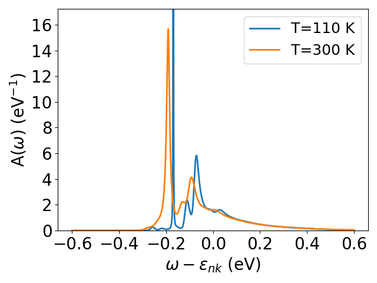

SpectralCumulant tutorial
=========================

In this section, we describe how to use Perturbopy to process a Perturbo ``'spectral-cum'`` calculation. 

The ``'spectral-cum'`` calculation computes the electron-phonon cumulant spectral function. We first run the Perturbo calculation following the instructions on the Perturbo website and obtain the h5 file, *'sto_spectral_cumulant.h5'*, and YAML file, *'sto_spectral-cum.yml'*. For more information, please refer to the `Perturbo website <https://perturbo-code.github.io/mydoc_cumulant.html#cumulant-spectral-functioncalc_mode--spectral-cum>`_. 

Next, we create the :py:class:`.SpectralCumulant` object using the h5 and YAML file as an input. This object contains all of the information from the two files.

.. code-block :: python

    import perturbopy.postproc as ppy

    # Example using the spectral-cum calculation mode.
    sc = ppy.SpectralCumulant.from_hdf5_yaml('sto_spectral_cumulant.h5', 'sto_spectral-cum.yml')

Accessing the data
------------------

The main results are stored in three attributes:

* :py:attr:`.SpectralCumulant.temp_array` stores the temperatures corresponding to the spectral data
* :py:attr:`.SpectralCumulant.freq_array` stores the energy values in eV
* :py:attr:`.SpectralCumulant.Akw` stores the spectral function data, indexed by the k-point, band, temperature, and frequency

All of these attributes are arrays. Examples on how to access the data are shown below.

.. code-block :: python
    
    # There are two temperatures used in this example. Units are in K.
    sc.temp_array
    >> array([110., 300.])

    # The range of energy values in eV used in the calculation.
    sc.freq_array
    >> array([-0.6, -0.5996, -0.5992, ..., 0.5992, 0.5996, 0.6])

    # The step size used in the energy grid. Units are in eV. 
    sc.freq_step
    >> array(0.0004)

    # The spectral function frequencies for the first k-point,
    # first band, and first temperature configuration.
    sc.Akw[0][0, 0, :]
    >> array([3.60912252e-04, 3.61516841e-04, 3.62122992e-04, ...,
              4.06079105e-01, 4.04920243e-01, 4.03765530e-01])

    # The spectral function frequencies for the first k-point,
    # second band, and first temperature configuration.
    sc.Akw[0][1, 0, :]
    >> array([3.63842250e-04, 3.64451850e-04, 3.65063026e-04, ...,
              4.03514361e-01, 4.02363134e-01, 4.01215968e-01])

    # The spectral function frequencies for the first k-point,
    # first band, and second temperature configuration.
    sc.Akw[0][0, 1, :]
    >> array([2.68217469e-05, 2.68033011e-05, 2.67848974e-05, ...,
              5.44580321e-01, 5.43094920e-01, 5.41611666e-01])

Plotting the data
-----------------

We can quickly visualize the data by plotting the cumulant spectral function. If there are multiple system configurations, we can choose which temperature to plot by setting ``it`` to the desired index in the temperature array. By default, the first temperature is used. We can also choose to plot the spectral function for specific bands by setting ``ib`` to the desired band index. By default, the band index is zero.

.. code-block :: python

    import perturbopy.postproc as ppy
    import matplotlib.pyplot as plt

    # Create a figure and axis for plotting
    fig, ax  = plt.subplots()

    sc.plot_Aw(ax, ik=0, it=0, ib=0)
    sc.plot_Aw(ax, ik=0, it=1, ib=0)
    plt.show()

Finally, we can plot the spectral function for a specific k-point in the grid by setting ``ik``. By default, the first k-point is used. Please refer to the :ref:`ephmat_tutorial` for details on plotting the data for different k-point indexes.
