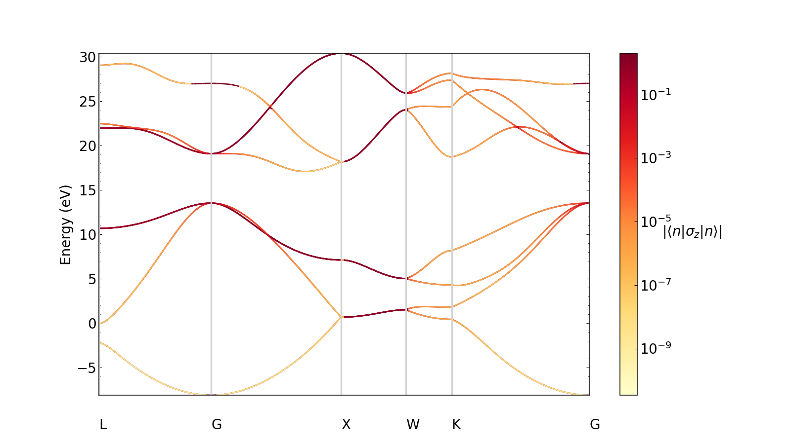
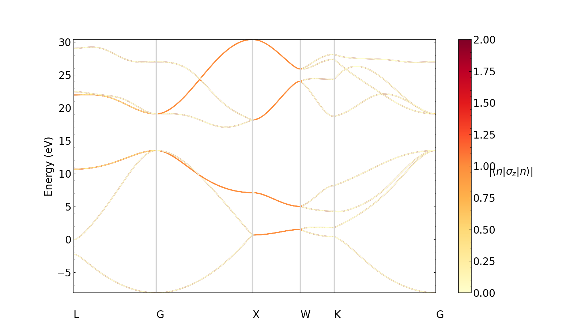

Spins tutorial
===============

In this section, we describe how to use Perturbopy to process a Perturbo ``'spins'`` calculation. 

The ``'spins'`` calculation mode interpolates the band structure using Wannier functions and computes the spin texture. We first run the Perturbo calculation following the instructions on the Perturbo website and obtain the YAML file, *'diam_spins.yml'*. For more information, please refer to the `Perturbo website <https://perturbo-code.github.io/mydoc_spin#spin-texturecalc_mode--spins>`_. 

Next, we create the :py:class:`.Spins` object using the YAML file as an input. This object contains all of the information from the YAML file.

.. code-block :: python

    import perturbopy.postproc as ppy

    # Example using the spins calculation mode
    diam_spins = ppy.Spins.from_yaml('diam_spins.yml')

Accessing the data
------------------

The outputs of the calculation are stored in three objects:
* :py:attr:`.Spins.kpt` stores the k-points used in the calculation
* :py:attr:`.Spins.bands` stores the interpolated band energies
* :py:attr:`.Spins.spins` stores the spin texture values

Please see the :ref:`exporting_data` section for more information on accessing data general to all calculation modes, such as input parameters and material properties.

K-points
--------

The k-points used for the spins calculation are stored in the :py:attr:`.Spins.kpt` attribute, which is of type :py:class:`.RecipPtDB`. For example, to access the k-point coordinates and their units (which are column-oriented):

.. code-block :: python
    
    # Obtain the first k-point
    diam_spins.kpt.points[:, 0]
    >> array([0.5, 0.5, 0.5])

    # There are 196 k-points
    diam_spins.kpt.points.shape
    >> (3, 196)

    diam_spins.kpt.units
    >> 'crystal'

Please see the section :ref:`handling_kpt_qpt` for details on accessing the k-points through this attribute.

Band energies
-------------

The interpolated band energies computed by the spins calculation are stored in the :py:attr:`.Spins.bands` attribute, which is a :py:class:`.UnitsDict` object. The keys represent the band index, and the values are arrays containing the band energies corresponding to each k-point. 

.. code-block :: python

    # The keys are the band indices, and here we have 16
    diam_spins.bands.keys()
    >> dict_keys([1, 2, 3, ..., 14, 15, 16])

    # Band energies of the 8th band
    diam_spins.bands[8]
    >> array([10.67315828, 10.67472505, ..., 13.51506129, 13.52024087])

Please see the section :ref:`physical_quantities` for details on accessing the bands and their units.

Spin textures
-------------

The spin texture values computed by the spins calculation are stored in the :py:attr:`.Spins.spins` attribute, which is a :py:class:`.UnitsDict` object. The keys represent the band index, and the values are arrays containing the spin texture values corresponding to each k-point. 

.. code-block :: python

    # The keys are the band indices, and here we have 16
    diam_spins.spins.keys()
    >> dict_keys([1, 2, 3, ..., 14, 15, 16])

    # Spin texture values of the 8th band
    diam_spins.spins[8]
    >> array([5.77350351e-01, 5.77348291e-01, ..., 8.64282329e-01, 1.00000000e+00])

Please see the section :ref:`physical_quantities` for details on accessing the spin texture values and their units.

Plotting the data
~~~~~~~~~~~~~~~~~

We can quickly visualize the spin texture by plotting them as a colormap overlaid on the band structure. Below, we plot the spin texture along the k-point path.

.. code-block :: python
    
    import matplotlib.pyplot as plt

    plt.rcParams.update(ppy.plot_tools.plotparams)
    diam_spins.kpt.add_labels(ppy.lattice.points_fcc)

    fig, ax  = plt.subplots()
    diam_spins.plot_spins(ax)
    plt.show()

We can choose whether or not we want to normalize the spin texture values on a log scale. For example, let's plot results on a linear scale. By default, the plot will normalize the values logarithmically.

.. code-block :: python
    
    plt.rcParams.update(ppy.plot_tools.plotparams)
    diam_spins.kpt.add_labels(ppy.lattice.points_fcc)

    fig, ax  = plt.subplots()
    diam_spins.plot_spins(ax, log=False)
    plt.show()

Note that k-point labels can be removed from the plot by setting the ``show_kpoint_labels`` input to False.
