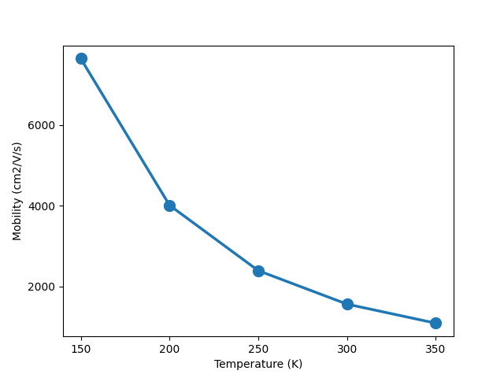

Transport tutorial
==================

In this section, we describe how to use Perturbopy to process a Perturbo transport calculation. The possible calculation modes are: ``trans``, ``trans-rta``, ``trans-ita``, ``trans-mag-rta``, ``trans-mag-ita``, and ``trans-pp``. Any of these calculation modes can be processed with the :py:class:`.Trans` object described below.

The transport calculation modes solve the Boltzmann transport equation (BTE) to compute the electrical conductivity, carrier mobility tensors as well as the Seebeck coefficient and thermal conductivity. We first run the Perturbo calculation following the instructions on the Perturbo website (running ``trans-rta`` as an example) and obtain the YAML file, *si_trans_rta.yml*. For more information, please refer to the `Perturbo website <https://perturbo-code.github.io/mydoc_trans.html>`_.

Next, we create the :py:class:`.Trans` object using the YAML file as an input. This object contains all of the information from the YAML file.

.. code-block :: python

    import perturbopy.postproc as ppy

    # Example using the trans-rta calculation mode
    si_trans_rta = ppy.Trans.from_yaml('si_trans-rta.yml')

    # Examples for the other calculation modes
    si_trans_ita = ppy.Trans.from_yaml('si_trans-ita.yml')
    si_trans_mag_rta = ppy.Trans.from_yaml('si_trans-mag-rta.yml')
    si_trans_mag_ita = ppy.Trans.from_yaml('si_trans-mag-ita.yml')
    si_trans_pp = ppy.Trans.from_yaml('si_trans-pp.yml')

Accessing the data
------------------

The main results of the results are categorized below: 

* information defining the configuration of the transport calculation (temperature, chemical potential, carrier concentration, and potentially magnetic field)
* computed transport properties for each configuration (electrical conductivity, carrier mobility tensors, and potentially Seebeck coefficient and thermal conductivity. If running an ITA calculation, there will also be conductivity results for each iteration.)

See :ref:`exporting_data` to learn how to access data from ``si_phdisp`` that is general for all calculation modes, such as input parameters and the material's crystal structure. # ERROR

Configuration data
~~~~~~~~~~~~~~~~~~

Transport calculations are run for various system configurations, i.e. the temperature, chemical potential, and carrier concentration. Information about the configuration(s), are stored in the following attributes:

* :py:attr:`.Trans.temper`
* :py:attr:`.Trans.chem_pot`
* :py:attr:`.Trans.conc`
* :py:attr:`.Trans.B_field` (if applicable)

All of these attributes are :py:class:`.UnitsDict` objects, which are Python dictionaries with an additional attribute that stores the units. The keys of the dictionary represent the configuration number. The values are floats representing the temperature, chemical potential, or carrier concentration of that configuration. If running a magnetic field calculation, there will also be an attribute for the magnetic field of each configuration.

For example, let's look at the temperatures.

.. code-block :: python

    # Keys are configuration number, values are temperatures
    si_trans_rta.temperature
    >> {1: 150.0, 2: 200.0, 3: 250.0, 4: 300.0, 5: 350.0}
    
    # Units are in Kelvin
    si_trans_rta.temperature.units
    >> 'K'

If we use the magnetic field calculation,

.. code-block :: python

    # We have one configuration and one B field
    si_trans_mag_rta.B_field
    >> {1: array([0.1, 0. , 0. ])}
    
    # Units are in Tesla
    si_trans_mag_rta.B_field.units
    >> 'T'

Please see the section :ref:`physical_quantities` for details on working with :py:class:`UnitsDict` objects.

Transport results
~~~~~~~~~~~~~~~~~

The following transport results are stored: 

* :py:attr:`.Trans.cond` : electrical conductivity
* :py:attr:`.Trans.mob` : carrier mobility
* :py:attr:`.Trans.seebeck` : Seebeck coefficient
* :py:attr:`.Trans.therm_cond` : thermal conductivity

All of these attributes are also :py:class:`.UnitsDict` objects. The keys of the dictionary represent the configuration number. The values are 3x3 numpy arrays, which represent the computed tensors for conductivity, mobility, seebeck coefficient, and thermal conductivity.

For example, let's look at the mobilities.

.. code-block :: python

    # Get the mobility tensor for the 4th configuration
    si_trans_rta.mob[4]

    >> array([[ 1.5574091e+03, -6.3873187e-03, -4.9675237e-03],
       [-6.3873187e-03,  1.5574506e+03,  2.4670994e-03],
       [-4.9675237e-03,  2.4670994e-03,  1.5574129e+03]])

    # Get the units
    si_trans_rta.mob.units
    >> 'cm2/V/s'

If a quantity is empty, it means it was not computed. This is sometimes the case for the Seebeck coefficient and thermal conductivity.

Please see the section :ref:`physical_quantities` for details on working with :py:class:`UnitsDict` objects.

Iteration data
~~~~~~~~~~~~~~

If we run ``calc_mode`` = ``trans-ita`` or ``trans-mag-ita``, we are solving the BTE iteratively. In this case, we can obtain information on the convergence of the conductivity over the iterations.  The data is stored in :py:attr:`.Trans.cond_iter`, which is a dictionary of dictionaries. The top level keys give the configuration number, and the second level keys give the iteration number.

.. code-block :: python

    # Get the conductivity tensors for the 1st configuration, at each of the four iterations
    si_trans_ita.cond_iter[2]

    >> {1: {1: [[24817.3, -0.10178186, -0.079157444],
       [-0.10178186, 24817.96, 0.039313206],
       [-0.079157444, 0.039313206, 24817.36]],
      2: [[25288.733, -0.025526387, -0.12887813],
       [-0.025526387, 25289.902, 0.058570355],
       [-0.12887813, 0.058570355, 25288.974]],
      3: [[25401.491, -0.034944053, -0.20791663],
       [-0.034944053, 25402.694, 0.059040028],
       [-0.20791663, 0.059040028, 25401.714]],
      4: [[25389.272, -0.031056698, -0.20778462],
       [-0.031056698, 25390.489, 0.059898721],
       [-0.20778462, 0.059898721, 25389.5]]}}

    # Get the units
    si_trans_ita.cond_iter.units

Plotting the data
-----------------

Below is an example for plotting the 'xx' component of mobility as a function of temperature.

.. code-block :: python

    import perturbopy.postproc as ppy
    import matplotlib.pyplot as plt
    import numpy as np

    fig, ax  = plt.subplots()

    # Optional
    plt.rcParams.update(ppy.plot_tools.plotparams)

    temperatures = np.array(list(si_trans_rta.temperatures.values()))

    # Get xx components of mobilities
    mobilities = np.array(list(si_trans_rta.mob.values()))[:, 0, 0]

    ax.plot(temperatures, mobilities)

    ax.set_xlabel(f"Temperature ({si_trans_rta.temperature.units})")
    ax.set_ylabel(f"Mobility ({si_trans_rta.mob.units})")

    plt.show()

It is straightforward to modify the above code to plot a different configuration property on the x-axis (such as magnetic field or carrier concentration) or a different computed transport property on the y-axis (such as conductivity).